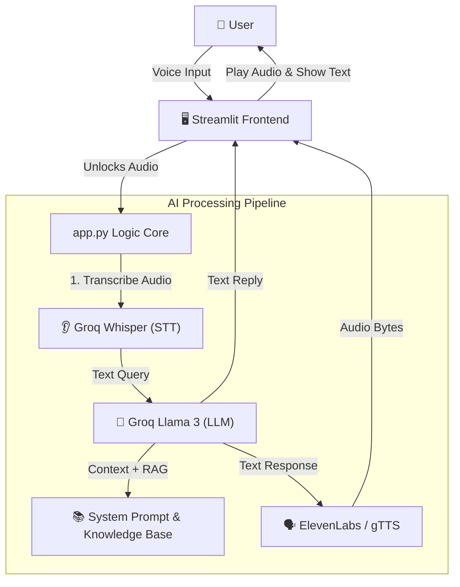

# 🎙️ Voice2Voice.Ai

   

**Voice2Voice.Ai** is a production-grade, monolithic voice-to-voice conversation agent.

It enables seamless, real-time voice interactions where users can ask complex questions and receive vocal responses with ultra-low latency.

---

## 🏗️ Architecture

The application follows a **Monolithic Streamlit Architecture** to ensure easy deployment on Streamlit Cloud without needing separate backend servers.



## 🚀 Features

- **🗣️ True Voice-to-Voice**: Speak normally, and the AI replies back in voice.
- **🧠 Domain Expert (AuditJiini)**: Pre-trained on Comply2Reg's full compliance suite (Regulens, Audit Geniee, AskLia).
- **⚡ Ultra-Fast Operations**: Uses Groq LPU chips for instant Speech-to-Text and Inference.
- **🔊 Smart Audio Fallback**:
  - Primary: **ElevenLabs** (Premium, Lifelike AI Voice).
  - Fallback: **Google TTS** (Unlimited Free Tier) if credits run out.
- **🎨 Professional UI**: Deep Dark Mode, "ChatGPT-style" bubbles, and auto-resetting input bars for fluid conversation.

---

## 📂 Project Structure

```text
voice-to-voice/
├── app.py                  # 🚀 MAIN ENTRY POINT (Monolith App)
├── requirements.txt        # Python dependencies for Cloud Deployment
├── backend/
│   ├── services/
│   │   ├── speech.py       # Groq Whisper Integration
│   │   ├── llm.py          # Llama 3 Logic & Prompt Injection
│   │   └── audio.py        # ElevenLabs + gTTS Fallback logic
│   └── system_prompt.txt   # 🧠 The Brain (Company Knowledge)
└── .env                    # Secrets (Local only)
```

---

## 🛠️ Local Installation

1. **Clone the Repository**
   ```bash
   git clone https://github.com/KiranRossi/Voice-2-Voice.git
   cd Voice-2-Voice
   ```

2. **Install Dependencies**
   ```bash
   pip install -r requirements.txt
   ```

3. **Configure Secrets**
   Create a `.env` file in the root directory:
   ```ini
   GROQ_API_KEY=gsk_...
   ELEVENLABS_API_KEY=xi_...
   ELEVENLABS_VOICE_ID=...
   ```

4. **Run the App**
   ```bash
   streamlit run app.py
   ```

---

## ☁️ Deployment Guide (Streamlit Cloud)

1. **Push to GitHub**: Ensure this repo is public or accessible.
2. **Login to Streamlit Cloud**: Go to [share.streamlit.io](https://share.streamlit.io/).
3. **Deploy**:
   - Repository: `KiranRossi/Voice-2-Voice`
   - Main File: `app.py`
4. **Add Secrets** (Crucial Step):
   - In Streamlit Cloud settings, go to **Secrets**.
   - Paste your keys in TOML format:
     ```toml
     GROQ_API_KEY = "gsk_..."
     ELEVENLABS_API_KEY = "xi_..."
     ELEVENLABS_VOICE_ID = "..."
     ```
5. **Launch!** 🚀

---

## 🧠 Knowledge Base details

The bot currently knows:
- **Founder**: Karthigeyan RJ (GenAI Expert).
- **Mission**: Ethical, white-box AI compliance.
- **Products**: Regulens, Compliance Gap Analysis, Audit Geniee.
- **Deployment**: SaaS vs On-Premise models.

*To update knowledge, simply edit `backend/system_prompt.txt`.*

---

**© 2026 Comply2Reg | Powered by Voice2Voice.Ai**
